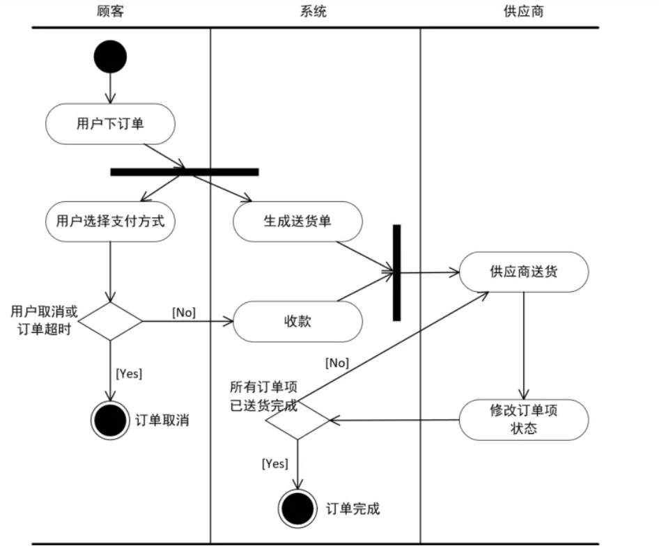

# 为什么使用python？

1.成熟的各种框架

2.零学习成本

3.因为这只是个作业，所以我们只注重功能的实现而不注重性能

# SAAS

而SaaS的本质是续费。

# UML泳道图示例



# 连接SQL SERVER

```python
import pyodbc
server = 'servername'
database = 'databasename'
username = 'username'
password = 'password'

connection_string = (
    f"DRIVER={{ODBC Driver 17 for SQL Server}};"
    f"SERVER={server};"
    f"DATABASE={database};"
    f"UID={username};"
    f"PWD={password}"
)
try:
 cnxn = pyodbc.connect(connection_string)
 print("Connection successful!")
#创建游标对象

cursor = cnxn.cursor()

#执行查询

cursor.execute("SELECT TABLE_NAME FROM INFORMATION_SCHEMA.TABLES WHERE TABLE_TYPE='BASE TABLE'")

#获取查询结果（结果是一个二维数组）

rows = cursor.fetchall()

#打印查询结果

for row in rows:
 print(row[0])

#关闭游标和连接

cursor.close()
 cnxn.close()
except Exception as e:
 print("Connection failed!")
 print(e)
```

# 获取短信

```python
# 导入Twilio API库
from twilio.rest import Client

# Twilio API凭证
account_sid = 'YOUR_ACCOUNT_SID'
auth_token = 'YOUR_AUTH_TOKEN'

# Twilio专用电话号码和接收验证码的电话号码
from_number = '+1234567890'
to_number = '+14155555555'

# 创建Twilio客户端
client = Client(account_sid, auth_token)

# 发送短信验证码
verification_code = 12345 # 实际上你需要生成一个随机验证码
message = f'Your verification code is {verification_code}'
client.messages.create(body=message, from_=from_number, to=to_number)

# 输出提示消息
print(f'Sent verification code {verification_code} to {to_number}')
```
